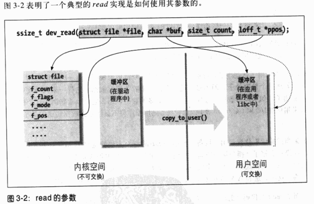

scull的设计
===============

scull实现下列设备：

1. **scull0 - scull3**          全局且持久的内存区域
2. **scullpipe0 - sullpipe3**   先进先出设备
3. **scullsingle**              一次只能一个进程使用
4. **scullpriv**                对每个进程都是私有的设备
5. **sculluid/sullwuid**        可被多次打开，但一次只能一个用户打开

主设备号和次设备号
--------------------
- 在内核中，dev_t类型用来保存设备编号，包括主设备号和次设备号
- dev_t是一个32位的数，其中前12位表示主设备号，20位表示次设备号
- 不应该对设备号的组织做任何假定，而应该始终使用以下宏：

.. code-block:: c

    <linux/types.h>
    MAJOR(dev_t dev); /* 获取主/次设备号 */
    MINOR(dev_t dev);

相反：

.. code-block:: c

    MKDEV(int majoir, int minor); /* 合成设备号 */

注册设备编号
---------------------
1. 静态注册：

.. code-block:: c

    <linux/fs.h>

    int register_chrdev_region(dev_t first, unsigned int count, char *name); /* 成功返回0,失败返回负数 */                                

2. 动态注册(推荐)：

.. code-block:: c

    int alloc_chrdev_region(dev_t *dev, unsigned int firstmino, \
                            unsigned int count, char *name);
    
3. 不论哪种方式注册，不再使用时，都要取消注册

.. code-block:: c

    void unregister_chrdev_region(dev_t first, unsigned int count);

创建设备文件
------------------

方法1: mknod命令

.. code-block:: sh

    mknode /dev/xxx c major minor

方法2: 调用: ``class_create`` ``device_create``

注：需在根文件系统中实现mdev或udev的机制

.. code-block:: c

    #define class_create(owner, /*　THIS_MODULE */
                          name)  /* 设备类名 */

    struct device device_create(struct class *cls,         /* 设备类 */
                             struct device *parent,         /* 父设备, 一般为NULL */
                                        dev_t devt,         /* 设备号 */
                                     void *drvdata,         /* 设备数据, 一般为NULL */
                                   const char *fmt, ...);   /* 设备文件名 */

    void device_destroy(struct class *cls, dev_t devt);

添加字符设备
------------------
内核使用struct cdev结构表示字符设备

.. code-block:: c
    
    struct cdev * my_cdev = cdev_alloc(); /* 为设备分配空间 */

    cdev_init(&dev->cdev, &scull_ops); /* 初始化cdev */
    dev->cdev.owner = THIS_MODULE;
    dev->cdev.ops = &scull_ops;

    int cdev_add(struct cdev *dev, dev_t num, unsigned int count); /* 将cdev加入到内核链表 */
    void cdev_del(struct cdev *dev); /* 移除cdev设备 */

调用open原理:
--------------------

操作系统内部已经建立了设备号-cdev-scull_fops三者的关系，所以当用户调用open(fd, "/dev/scull");打开设备文件的时候，操作系统就可以根据设备名得到设备号，再根据设备号找到cdev,进而找到fops,从而为进程在内核中建立struct file表,返回对应文件描述符。

+-----------------------------+------------------------------+
|      驱动 cdev_add之后      |         用户调用open之后     |
+=============================+==============================+
| .. image:: image/cdev.png   | .. image:: image/cdev-1.png  |
|    :width: 350px            |    :width: 350px             |
+-----------------------------+------------------------------+
    
一些重要的数据结构
---------------------

.. code-block:: c

    struct inode {
        ...
        dev_t i_rdev;           /* 包含实际的设备编号 */
        struct cdev *i_cdev;    /* 指向字符设备cdev */
    }
    unsigned int imajor(struct inode *inode); /* 获取主设备号 */
    unsigned int iminor(struct inode *inode); /* 获取次设备号 */

    struct file_operations {
        ...
    }

    struct file {
        ...
        *f_op; /* 文件操作集 */
        f_ops; /* 读写位置 */
        f_flags /* 读写模式 */
        private_data /* 私有数据 */
    }

调用read原理:
-----------------
read/write核心调用函数

.. code-block:: c

    unsigned long copy_to_user(void __user *to, const void *from, unsigned long count);
    unsigned long copy_from_user(void *to, const void __user *from, unsigned long count);

使用copy_to_user原因：

1. 不同的体系结构，内核空间与用户空间的映射关系是不一样的
2. 复制前检查是否是该进程的可写空间，防止用户传递非法的buf地址，造成内核结构破坏

总结
------

实现字符设备驱动步骤：

1. 确定主次设备号
2. 创建设备文件名接口
3. 将字符设备添加到内核
4. 实现驱动中的功能函数

.. code-block:: c

    <linux/types.h>
    dev_t

    <linux/kdev_t.h>
    MAJOR /*获取主设备号*/
    MINOR /*获取次设备号*/
    MKDEV /*合成设备号*/

    <linux/fs.h>
    imajor /* 由inode中获取主设备号 */
    iminor /* 由inode中获取次设备号 */
    register_chrdev_region  /* 指定设备号注册 */
    alloc_chrdev_region     /* 自动分配设备号注册 */
    unregister_chrdev_region /* 取消设备号注册 */

    <linux/device.h>
    class_create    /* 创建设备类 */
    class_destory
    device_create   /* 创建设备文件 */
    device_destory

    <linux/cdev.h>
    cdev_alloc  /* 分配cdev */
    cdev_init   /* 初始化cdev */
    cdev_add    /* 添加入内核 */
    cdev_del    /* 移除cdev */

    <asm/uaccess.h>
    copy_to_user /* 用户空间与内核空间交换数据 */
    copy_from_user

    <linux/kernel.h>
    container_of(pointer, type, field); /* 从包含在某个结构中的指针获取结构本身的指针 */
    
    <linux/slab.h>
    p = kmalloc(size, GFP_KERNEL);  /* 分配内存 */
    kfree(p);   /* 释放内存 */

    /* 数据结构 */
    struct class
    struct device
    struct inode
    struct cdev
    struct file_operations
    struct file
