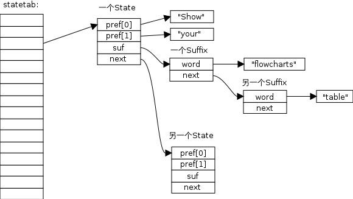

ffgg
==========

.. graphviz::

    digraph foo {
    "bar" -> "baz";
    }

.. code-block:: python

    def say_hello():
        printf 'hello, ReST'

    if __name__ = '__main__'
        say_hello()

当向一个空键推入新元素时，
``pushGenericCommand`` 函数执行以下两件事：

1. 检查这个键是否存在于前面提到的 ``server.db[i]->blocking_keys`` 字典里， 如果是的话， 那么说明有至少一个客户端因为这个 key 而被阻塞，程序会为这个键创建一个 ``redis.h/readyList`` 结构， 并将它添加到 ``server.ready_keys`` 链表中。

   2. 将给定的值添加到列表键中。

   ``readyList`` 结构的定义如下：

.. code-block:: c

       typedef struct readyList {
               redisDb *db;
               robj *key;
       } readyList;
